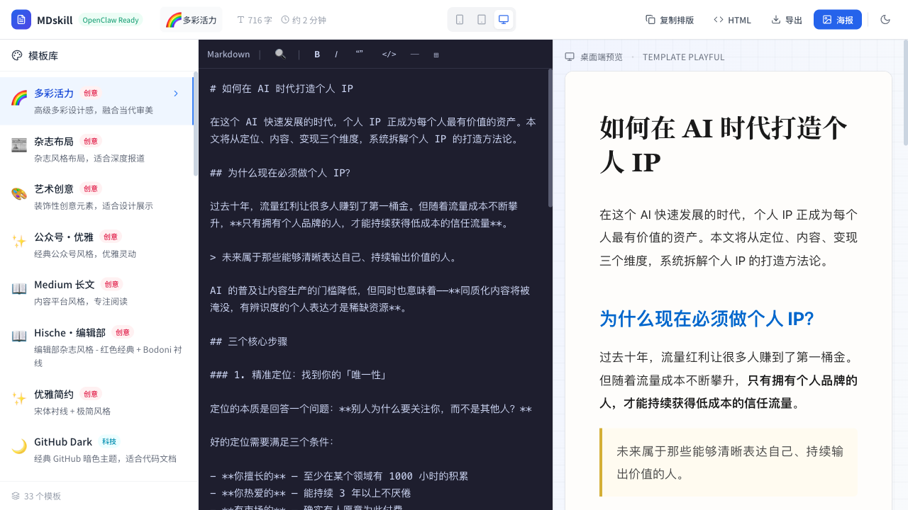

<div align="center">

# 🎨 MDskill-Web

**一键生成精美 Markdown 排版 | 33 种专业主题 | 微信公众号完美适配**

[](https://github.com/AIPMAndy/MDskill-Web/releases)
[](LICENSE)
[](https://github.com/AIPMAndy/MDskill-Web/pulls)

[在线体验](https://mdskill-web.netlify.app) · [功能介绍](#-核心功能) · [主题预览](#-33-种专业主题) · [快速开始](#-快速开始)



</div>

---

## ✨ 核心功能

### 🎨 33 种专业主题
从极简到华丽，从技术到文艺，满足所有排版需求：
- ⭐ **Apple 风格系列** - Light/Dark/Gray，官方设计美学
- 🧘 **禅意留白** - 极致简约，突出内容本身
- 💻 **开发者系列** - Terminal/Code/Cyberpunk，技术范儿
- 📰 **媒体专业系列** - NYTimes/Guardian/Wired，新闻质感
- 📱 **微信公众号系列** - 7 个专为公众号优化的主题

### 📱 微信公众号完美适配
- ✅ 完全内联样式，无需额外处理
- ✅ 一键复制，直接粘贴到公众号编辑器
- ✅ 保留所有格式和颜色
- ✅ 手机端完美显示

### 🚀 实时编辑预览
- 分屏编辑，左写右看
- Markdown 实时渲染
- 支持代码高亮、表格、任务列表
- 响应式预览（Desktop/Tablet/Mobile）

### 💾 多种导出方式
- **富文本复制** - 直接粘贴到公众号/知乎/掘金
- **HTML 导出** - 完整网页文件
- **图片生成** - 适合分享和存档

### 🔍 强大的搜索功能
- 全文搜索，实时匹配
- 正则表达式支持
- 大纲导航，快速定位
- 搜索结果高亮

---

## 🎨 33 种专业主题

### 🌟 热门推荐

| 主题 | 风格 | 适用场景 |
|------|------|----------|
| **Apple Light** 🍎 | 简洁优雅 | 产品文档、用户指南 |
| **Apple Dark** 🌙 | 暗色护眼 | 技术博客、代码文档 |
| **禅意留白** 🧘 | 极简美学 | 个人随笔、思考笔记 |
| **多彩活力** 🌈 | 活力设计 | 创意内容、品牌故事 |
| **NYTimes** 📰 | 严谨专业 | 新闻报道、深度分析 |
| **Medium** 📝 | 长文阅读 | 长篇文章、故事叙述 |

### 📂 完整分类

<details>
<summary><b>创意类 (7个)</b> - 适合品牌、设计、创意内容</summary>

- 🌈 **多彩活力** - 高级多彩设计感
- 📰 **杂志布局** - 杂志风格排版
- 🎨 **艺术创意** - 装饰性设计元素
- ✨ **公众号·优雅** - 经典公众号风格
- 📝 **Medium 长文** - 适合长篇阅读
- ✏️ **Hische 编辑部** - 手写创意风格
- 🎭 **优雅简约** - 简约而不简单

</details>

<details>
<summary><b>技术类 (9个)</b> - 适合开发者、技术博客</summary>

- 🌙 **GitHub Dark** - 经典暗色主题
- ☀️ **GitHub Light** - 清爽亮色主题
- ⚡ **Wired 连线** - 科技媒体风格
- 🤖 **Anthropic Claude** - AI 风格
- 💻 **开发者** - 代码风格
- 🖥️ **终端控制台** - 终端风格
- 🌃 **赛博朋克** - 未来科技感
- 🏢 **Silicon Valley** - 硅谷创业风格
- 💬 **Claude AI** - 对话风格

</details>

<details>
<summary><b>极简类 (9个)</b> - 适合专注内容、简约设计</summary>

- 🧘 **禅意留白** - 极致简约
- 🍎 **Apple Light** - Apple 官方亮色
- 🌑 **Apple Dark** - Apple 官方暗色
- ⚪ **Apple Gray** - Apple 中性灰
- ✨ **极简现代** - 现代简约
- 💎 **Minimal Pro** - 专业极简
- 📄 **纸质纹理** - 自然纸感
- 🍏 **Apple 极简** - 公众号极简风

</details>

<details>
<summary><b>商务类 (6个)</b> - 适合报告、文档、专业内容</summary>

- 📰 **纽约时报** - 经典报业风格
- 🗞️ **Guardian 卫报** - 英伦新闻风格
- 📋 **焦橙文档** - 温暖商务风格
- 📱 **公众号·纽约时报** - 新闻报道风格
- 📝 **公众号·Medium** - 长文阅读风格
- 📚 **深度阅读** - 深度内容风格

</details>

<details>
<summary><b>故事类 (2个)</b> - 适合小说、日记、故事创作</summary>

- 📖 **小说阅读** - 书籍阅读体验
- 📔 **个人日记** - 手写日记风格

</details>

---

## 🚀 快速开始

### 方式一：在线使用（推荐）

访问 [https://mdskill-web.netlify.app](https://mdskill-web.netlify.app) 立即开始使用

### 方式二：本地部署

```bash
# 克隆项目
git clone https://github.com/AIPMAndy/MDskill-Web.git
cd MDskill-Web

# 安装依赖
npm install

# 启动开发服务器
npm run dev
# 访问 http://localhost:3000

# 或构建生产版本
npm run build
# 部署 dist/ 目录到任意静态服务器
```

### 方式三：命令行工具

```bash
# 安装依赖
npm install

# 使用 CLI
node cli.js input.md --template apple-light --output output.html
```

详细命令行参数请查看 [CLI 文档](./CLI.md)

---

## 📖 使用教程

### 微信公众号使用

1. **编辑 Markdown** - 在左侧编辑器输入或粘贴内容
2. **选择主题** - 点击侧边栏按钮，选择喜欢的主题
3. **一键复制** - 点击顶部"复制排版"按钮
4. **粘贴发布** - 直接粘贴到公众号编辑器，完美显示

> 💡 推荐主题：wechat-elegant、wechat-medium、wechat-apple

### 技术博客使用

1. 选择开发者系列主题（code、terminal、github-light）
2. 编辑 Markdown，支持代码高亮
3. 导出 HTML 或复制富文本
4. 发布到掘金、CSDN、博客园等平台

### 个人创作使用

1. 选择禅意留白、小说阅读等主题
2. 专注内容创作，实时预览
3. 导出图片或 HTML 保存
4. 分享到社交媒体

---

## 🛠️ 技术栈

- **前端框架**: React 18 + TypeScript
- **构建工具**: Vite 5
- **样式方案**: Tailwind CSS
- **Markdown 解析**: Marked
- **HTML 清理**: DOMPurify
- **图片生成**: html2canvas

---

## 🌟 为什么选择 MDskill-Web？

### vs Markdown 编辑器
- ✅ 不只是编辑器，更是排版工具
- ✅ 33 种专业主题，开箱即用
- ✅ 微信公众号完美适配

### vs 公众号排版工具
- ✅ 完全免费开源
- ✅ 本地运行，数据安全
- ✅ 支持代码高亮、数学公式

### vs 自己写 CSS
- ✅ 节省大量时间，即刻上手
- ✅ 专业设计师调教的配色
- ✅ 响应式布局，移动端友好

---

## 📊 项目统计

- ⭐ 33 种专业主题
- 📦 打包体积 138KB (gzip)
- ⚡ 构建时间 < 2 秒
- 🎯 TypeScript 100% 类型安全
- ✅ 功能测试覆盖完整

---

## 🗺️ 路线图

### v1.3.0（计划中）
- [ ] PDF 导出功能
- [ ] 自定义主题编辑器
- [ ] 主题收藏和分组
- [ ] 暗色模式优化

### v2.0.0（规划中）
- [ ] 云端同步
- [ ] 多人协作
- [ ] 插件系统
- [ ] 移动端 App

---

## 🤝 贡献指南

欢迎提交 Issue 和 Pull Request！

### 贡献主题

1. Fork 项目
2. 在 `src/templates/index.ts` 添加你的主题配置
3. 确保 TypeScript 编译通过
4. 提交 PR 并附上预览截图

### 贡献代码

1. 阅读现有代码，理解项目结构
2. 遵循 ESLint 规则
3. 添加必要的注释
4. 提交前运行 `npm run lint` 和 `npm run build`

---

## 📄 开源协议

Apache 2.0 License + 附加条款

### ✅ 允许
- ✅ 个人学习和使用
- ✅ 企业内部使用
- ✅ 二次开发（需保留版权）
- ✅ 开源项目引用

### ❌ 禁止（需书面授权）
- ❌ 去除品牌标识
- ❌ 提供商业 SaaS 服务
- ❌ 转售或授权给第三方

商业授权请联系：**微信 AIPMAndy**

---

## 📮 联系方式

- **作者**: Andy | AI酋长
- **微信**: AIPMAndy
- **GitHub**: [@AIPMAndy](https://github.com/AIPMAndy)
- **邮箱**: 商务合作请通过微信联系

---

## 🎁 相关项目

- 🖥️ [**MDskill (Mac)**](https://github.com/AIPMAndy/MDSKILL) - MDskill 桌面端，功能更强大
- 🌐 **MDskill-Web** - 本项目，在线版本

---

<div align="center">

### ⭐ 如果这个项目对你有帮助，请给个 Star 支持一下！

Made with ❤️ by [Andy](https://github.com/AIPMAndy)

[⬆ 回到顶部](#-mdskill-web)

</div>
